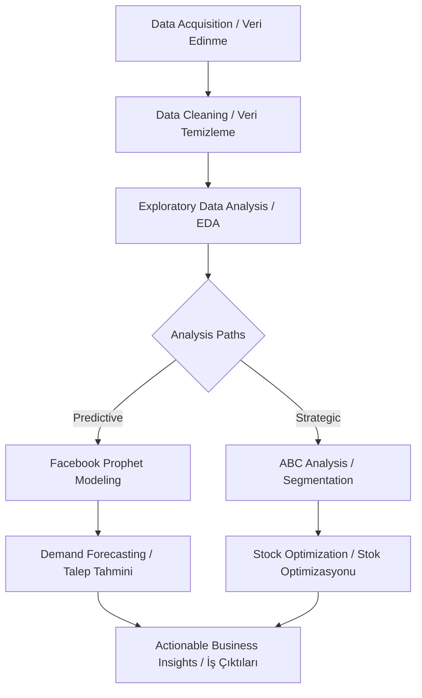

# Amazon Sales Forecasting & Inventory Optimization
### (Amazon Satış Tahmini ve Envanter Optimizasyonu)
---
## 🇺🇸 English Description
Efficient inventory management is the backbone of e-commerce. This project solves two major problems:
1. **Demand Uncertainty:** Predicting future sales to prevent stockouts.
2. **Capital Allocation:** Identifying high-value products to prioritize investment.

###  Data Science Pipeline
- **Cleaning:** Rigorous null handling and data type standardization on 128k+ rows.
- **EDA:** Deep-dive into category performance and temporal patterns.
- **Forecasting:** Leveraging **Facebook Prophet** to capture seasonality and holiday effects.
- **Optimization:** Implementing **ABC Analysis** to categorize products (A: Critical, B: Important, C: Low priority).

---

## 🇹🇷 Türkçe Açıklama

### İş Problemi
E-ticarette verimli envanter yönetimi başarının anahtarıdır. Bu proje iki temel soruna çözüm sunar:
1. **Talep Belirsizliği:** Stok tükenmesini önlemek için gelecekteki satışları tahmin etmek.
2. **Sermaye Alokasyonu:** Yatırımı önceliklendirmek için yüksek değerli ürünleri belirlemek.

### Veri Bilimi İş Akışı
- **Temizlik:** 128 binden fazla satır üzerinde titiz eksik veri yönetimi ve veri tipi standardizasyonu.
- **EDA (Keşifçi Analiz):** Kategori performansı ve zamansal döngülerin derinlemesine analizi.
- **Tahminleme:** Mevsimsellik ve tatil etkilerini yakalamak için **Facebook Prophet** kullanımı.
- **Optimizasyon:** Ürünleri stratejik olarak sınıflandırmak için **ABC Analizi** uygulaması (A: Kritik, B: Önemli, C: Düşük öncelik).

## Methodology / Metodoloji

* This project follows a structured data science lifecycle to ensure the transition from raw data to strategic business decisions.

* (Bu proje, ham veriden stratejik iş kararlarına geçişi sağlamak için yapılandırılmış bir veri bilimi yaşam döngüsünü takip eder.)

### Project Architecture / Proje Mimarisi

###  Methodology Details / Metodoloji Detayları
#### 🇺🇸 English
* **Data Ingestion:** Merging multiple Amazon sales reports (**128k+ rows**) and identifying key features like `Order Date`, `Category`, and `Revenue`.
* **Preprocessing & Integrity:**
    * Converting date formats and standardizing currency/numerical columns.
    * Handling missing values and filtering out non-revenue transactions (canceled/returned) to ensure data quality.
* **Exploratory Data Analysis (EDA):** Statistical profiling to uncover sales distribution, top-performing categories, and regional demand patterns.
* **Time-Series Analysis (Forecasting):**
    * Using **Facebook Prophet** to decompose data into trend, weekly, and yearly seasonality.
    * Adjusting for holiday effects to increase forecast precision for e-commerce peaks.
* **Inventory Optimization:** Implementing **ABC Analysis** to classify products based on their cumulative contribution to total revenue, enabling strategic stock management.

---

#### 🇹🇷 Türkçe
* **Veri Toplama:** Çok kaynaklı Amazon satış raporlarını (**128 bin+ satır**) birleştirme; `Sipariş Tarihi`, `Kategori` ve `Gelir` gibi temel özellikleri belirleme.
* **Ön İşleme ve Veri Bütünlüğü:**
    * Tarih formatlarını dönüştürme ve sayısal sütunları standartlaştırma.
    * Eksik değerleri yönetme ve gerçek gelire odaklanmak için tamamlanmamış (iptal/iade) işlemleri filtreleyerek veri kalitesini artırma.
* **Keşifçi Veri Analizi (EDA):** Satış dağılımını, en iyi performans gösteren kategorileri ve bölgesel talep modellerini ortaya çıkarmak için istatistiksel profilleme.
* **Zaman Serisi Analizi (Tahminleme):**
    * Verileri trend, haftalık ve yıllık mevsimsellik bileşenlerine ayırmak için **Facebook Prophet** kullanımı.
    * E-ticaret zirve dönemleri için tahmin hassasiyetini artırmak amacıyla tatil etkilerinin modele dahil edilmesi.
* **Envanter Optimizasyonu:** Stratejik stok yönetimini sağlamak amacıyla ürünleri toplam gelire kümülatif katkılarına göre sınıflandırmak için **ABC Analizi** uygulaması.
