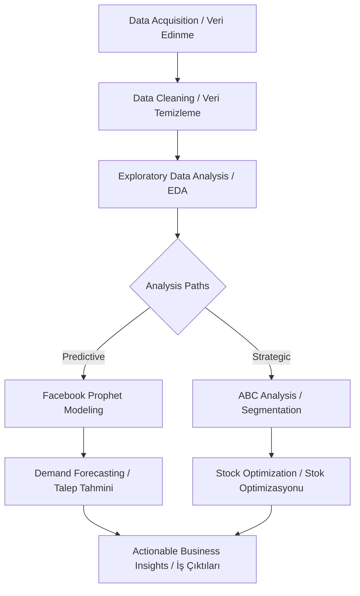
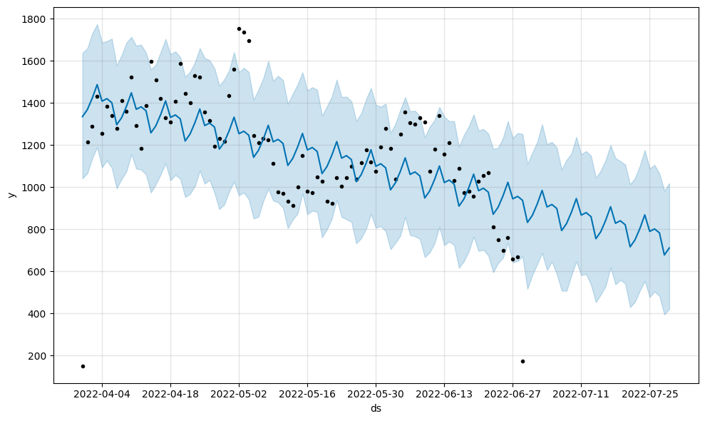
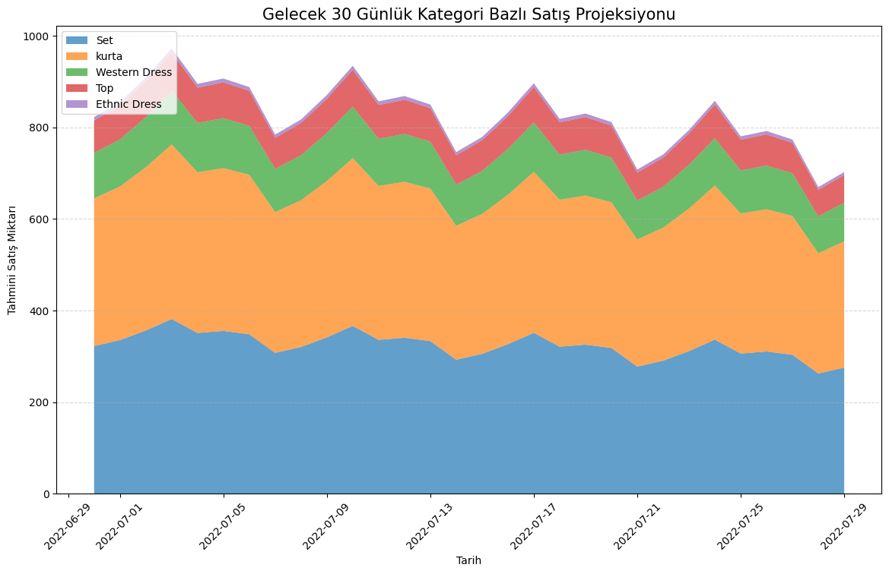
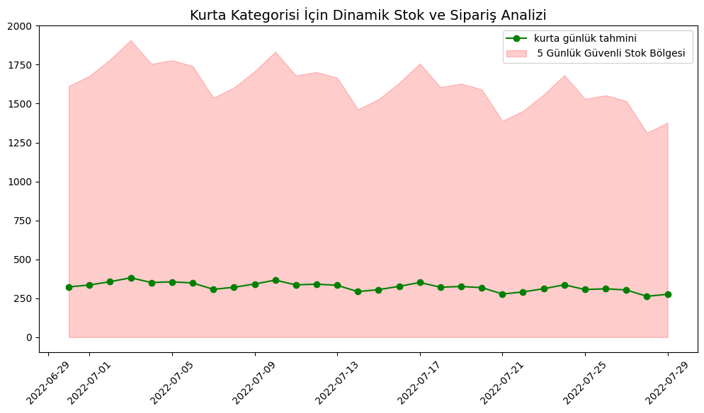
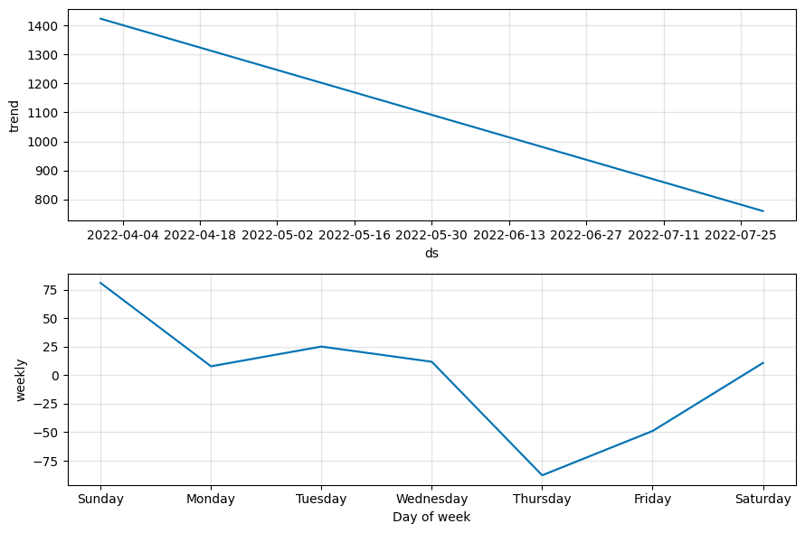
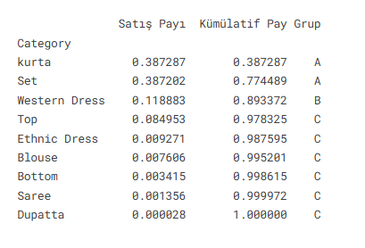
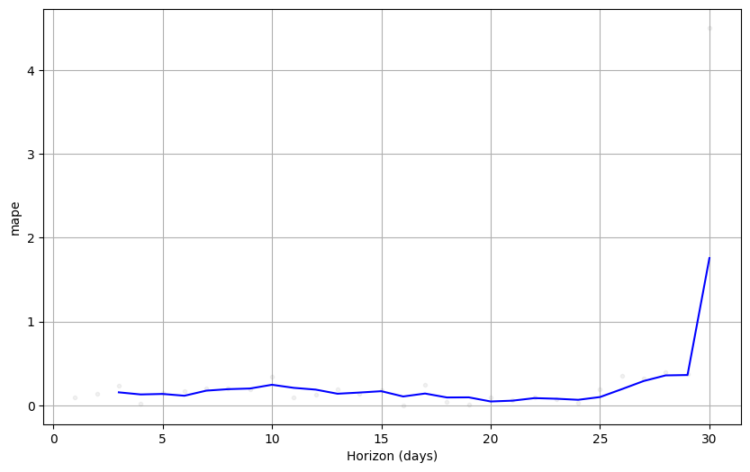

# 📦 Amazon Sales Forecasting & Inventory Optimization
### (Amazon Satış Tahmini ve Envanter Optimizasyonu)
---
## 🇺🇸 English Description
Efficient inventory management is the backbone of e-commerce. This project solves two major problems:
1. **Demand Uncertainty:** Predicting future sales to prevent stockouts.
2. **Capital Allocation:** Identifying high-value products to prioritize investment.

###  Data Science Pipeline
- **Cleaning:** Rigorous null handling and data type standardization on 128k+ rows.
- **EDA:** Deep-dive into category performance and temporal patterns.
- **Forecasting:** Leveraging **Facebook Prophet** to capture seasonality and holiday effects.
- **Optimization:** Implementing **ABC Analysis** to categorize products (A: Critical, B: Important, C: Low priority).

---

## 🇹🇷 Türkçe Açıklama

### İş Problemi
E-ticarette verimli envanter yönetimi başarının anahtarıdır. Bu proje iki temel soruna çözüm sunar:
1. **Talep Belirsizliği:** Stok tükenmesini önlemek için gelecekteki satışları tahmin etmek.
2. **Sermaye Alokasyonu:** Yatırımı önceliklendirmek için yüksek değerli ürünleri belirlemek.

### Veri Bilimi İş Akışı
- **Temizlik:** 128 binden fazla satır üzerinde titiz eksik veri yönetimi ve veri tipi standardizasyonu.
- **EDA (Keşifçi Analiz):** Kategori performansı ve zamansal döngülerin derinlemesine analizi.
- **Tahminleme:** Mevsimsellik ve tatil etkilerini yakalamak için **Facebook Prophet** kullanımı.
- **Optimizasyon:** Ürünleri stratejik olarak sınıflandırmak için **ABC Analizi** uygulaması (A: Kritik, B: Önemli, C: Düşük öncelik).

## Methodology / Metodoloji

* This project follows a structured data science lifecycle to ensure the transition from raw data to strategic business decisions.

* (Bu proje, ham veriden stratejik iş kararlarına geçişi sağlamak için yapılandırılmış bir veri bilimi yaşam döngüsünü takip eder.)

### Project Architecture / Proje Mimarisi

###  Methodology Details / Metodoloji Detayları
#### 🇺🇸 English
* **Data Ingestion:** Merging multiple Amazon sales reports (**128k+ rows**) and identifying key features like `Order Date`, `Category`, and `Revenue`.
* **Preprocessing & Integrity:**
    * Converting date formats and standardizing currency/numerical columns.
    * Handling missing values and filtering out non-revenue transactions (canceled/returned) to ensure data quality.
* **Exploratory Data Analysis (EDA):** Statistical profiling to uncover sales distribution, top-performing categories, and regional demand patterns.
* **Time-Series Analysis (Forecasting):**
    * Using **Facebook Prophet** to decompose data into trend, weekly, and yearly seasonality.
    * Adjusting for holiday effects to increase forecast precision for e-commerce peaks.
* **Inventory Optimization:** Implementing **ABC Analysis** to classify products based on their cumulative contribution to total revenue, enabling strategic stock management.

---

#### 🇹🇷 Türkçe
* **Veri Toplama:** Çok kaynaklı Amazon satış raporlarını (**128 bin+ satır**) birleştirme; `Sipariş Tarihi`, `Kategori` ve `Gelir` gibi temel özellikleri belirleme.
* **Ön İşleme ve Veri Bütünlüğü:**
    * Tarih formatlarını dönüştürme ve sayısal sütunları standartlaştırma.
    * Eksik değerleri yönetme ve gerçek gelire odaklanmak için tamamlanmamış (iptal/iade) işlemleri filtreleyerek veri kalitesini artırma.
* **Keşifçi Veri Analizi (EDA):** Satış dağılımını, en iyi performans gösteren kategorileri ve bölgesel talep modellerini ortaya çıkarmak için istatistiksel profilleme.
* **Zaman Serisi Analizi (Tahminleme):**
    * Verileri trend, haftalık ve yıllık mevsimsellik bileşenlerine ayırmak için **Facebook Prophet** kullanımı.
    * E-ticaret zirve dönemleri için tahmin hassasiyetini artırmak amacıyla tatil etkilerinin modele dahil edilmesi.
* **Envanter Optimizasyonu:** Stratejik stok yönetimini sağlamak amacıyla ürünleri toplam gelire kümülatif katkılarına göre sınıflandırmak için **ABC Analizi** uygulaması.

## Key Insights & Strategic Results / Önemli Bulgular ve Stratejik Sonuçlar
---
1. ## Prophet Sales Forecast Overview/ Prophet Satış Tahmini Genel Görünümü

### 🇺🇸 English

This visualization presents the overall sales forecast generated using the Prophet time series forecasting model.

Key elements in the chart:

- **Black dots:** represent the actual observed sales values.
- **Blue line:** represents the predicted values produced by the Prophet model.
- **Light blue shaded area:** indicates the uncertainty interval (confidence interval) of the forecast.

The model captures a **general downward trend** in the sales data over time.  
While most predictions align with historical observations, some extreme values (outliers) are not perfectly captured, which is typical for time series models that focus on learning overall trends and seasonality.

The forecast extends **30 days into the future**, showing that the declining trend may continue in the upcoming period. Additionally, the uncertainty band widens as the forecast moves further into the future, reflecting increasing prediction uncertainty.

---

### 🇹🇷 Türkçe

Bu grafik, Prophet zaman serisi modeli kullanılarak elde edilen genel satış tahminini göstermektedir.

Grafikteki temel bileşenler:

- **Siyah noktalar:** Gerçek satış verilerini temsil etmektedir.
- **Mavi çizgi:** Prophet modeli tarafından üretilen tahmini satış değerlerini göstermektedir.
- **Açık mavi alan:** Tahmin belirsizlik aralığını (güven aralığı) ifade etmektedir.

Model sonuçları satış verilerinde **genel olarak azalan bir trend** olduğunu göstermektedir.  
Tahminler çoğu noktada gerçek verilerle uyumlu olsa da bazı uç değerler model tarafından tam olarak yakalanamamaktadır. Bu durum, zaman serisi modellerinin genel trend ve sezonsallığı öğrenmeye odaklanmasından kaynaklanmaktadır.

Model ayrıca **gelecek 30 gün için satış tahmini** üretmiş ve bu dönemde düşüş eğiliminin devam edebileceğini göstermiştir. Tahmin aralığının zaman ilerledikçe genişlemesi, geleceğe yönelik belirsizliğin arttığını göstermektedir.

2. ## Category-based 30 Day Sales Projection/ Kategori Bazlı 30 Günlük Satış Projeksiyonu

#### 🇺🇸 English
This visualization shows the projected sales distribution across product categories for the next 30 days.  
Each colored area represents a product category, allowing us to observe how total sales are composed over time.

Key observations:

- **Set** and **Kurta** categories dominate the overall sales volume.
- **Kurta** consistently contributes a large portion of total sales, indicating strong and stable demand.
- **Western Dress**, **Top**, and **Ethnic Dress** contribute smaller but stable portions of total sales.
- The stacked structure allows us to observe **relative category contribution** to total demand.
- A slight downward trend can be observed toward the end of the forecast period, suggesting a potential decrease in overall demand.

### Strategic Insight:

From a business perspective, inventory and marketing strategies should prioritize **Set** and **Kurta** categories, as they represent the largest share of projected demand.

---

#### 🇹🇷 Türkçe

Bu görselleştirme, gelecek **30 gün için kategori bazlı satış projeksiyonunu** göstermektedir.  
Her renk farklı bir ürün kategorisini temsil eder ve toplam satışın kategorilere göre dağılımını göstermektedir.

Öne çıkan bulgular:

- **Set** ve **Kurta** kategorileri toplam satış hacminin büyük bölümünü oluşturmaktadır.
- **Kurta kategorisi** sürekli olarak yüksek talep göstermektedir.
- **Western Dress**, **Top** ve **Ethnic Dress** kategorileri daha düşük fakat stabil bir satış katkısı sağlamaktadır.
- Yığılmış alan grafiği sayesinde **kategorilerin toplam satış içindeki payları** kolayca gözlemlenebilmektedir.
- Tahmin döneminin sonuna doğru **hafif bir düşüş eğilimi** görülmektedir.

### Stratejik çıkarım:

Stok yönetimi ve pazarlama stratejilerinde özellikle **Set ve Kurta kategorilerine öncelik verilmesi** önerilmektedir.

3. ## Dynamic Inventory & Order Planning for Kurta/ Kurta Kategorisi İçin Dinamik Stok ve Sipariş Analizi

### 🇺🇸 English

This chart focuses specifically on the **Kurta category** and presents daily demand forecasts along with a calculated safety stock zone.

Key observations:

- The green line represents the **daily predicted demand for Kurta products**.
- The shaded red region indicates the **5-day safety stock buffer** designed to prevent stockouts.
- Demand fluctuates between approximately **260–380 units per day**.
- Despite minor fluctuations, the demand remains relatively stable throughout the forecast period.

### Strategic Insight:
Maintaining a safety stock buffer is essential for high-demand categories like Kurta.  
This approach helps businesses:

- Reduce stockout risk
- Stabilize supply chain operations
- Improve customer satisfaction

This analysis supports **data-driven inventory planning and demand forecasting strategies**.

---

### 🇹🇷 Türkçe

Bu grafik **Kurta kategorisi için günlük talep tahmini ve güvenli stok bölgesini** göstermektedir.

Grafik yorumları:
- Yeşil çizgi **Kurta ürünleri için günlük tahmini talebi** göstermektedir.
- Kırmızı gölgeli alan **5 günlük güvenli stok bölgesini** temsil etmektedir.
- Günlük talep yaklaşık olarak **260–380 adet arasında değişmektedir**.
- Talepte küçük dalgalanmalar olsa da genel olarak **istikrarlı bir talep yapısı** görülmektedir.

### Stratejik çıkarım:

Kurta gibi yüksek talep gören kategoriler için **güvenli stok planlaması** kritik öneme sahiptir.

Bu yaklaşım:
- Stok tükenme riskini azaltır
- Tedarik zinciri yönetimini iyileştirir
- Müşteri memnuniyetini artırır
Bu analiz, **veriye dayalı stok yönetimi ve talep tahmini stratejilerinin** geliştirilmesine katkı sağlar.

--- 
4. ##  Sales Trend Component / Satış Trend Bileşeni

#### 🇺🇸 English

This visualization shows the **trend component extracted from the Prophet time series model**.  
The trend represents the long-term movement of sales over time.

Key observations:

- A **steady downward trend** can be observed across the analyzed time period.
- Sales decrease gradually from around **1400 units to approximately 760 units**.
- The smooth decline indicates a **consistent reduction in sales rather than short-term fluctuations**.

Possible explanations include:

- Changes in customer demand
- Seasonal effects
- Inventory availability
- Market competition

### Strategic Insight

Monitoring declining trends is crucial for businesses.  
Companies may consider **adjusting pricing strategies, introducing promotions, or refreshing product assortments** to counteract decreasing demand.

---

#### 🇹🇷 Türkçe

Bu görselleştirme, Prophet zaman serisi modelinden elde edilen **trend bileşenini** göstermektedir.  
Trend bileşeni satışların zaman içerisindeki **uzun vadeli yönünü** temsil eder.

Öne çıkan bulgular:

- Analiz edilen zaman aralığında **düzenli bir düşüş eğilimi** gözlemlenmektedir.
- Satışlar yaklaşık **1400 seviyesinden 760 seviyesine doğru kademeli olarak azalmaktadır**.
- Bu düşüş kısa vadeli dalgalanmalardan ziyade **sürekli bir azalma eğilimine işaret etmektedir**.

Bu durum şu faktörlerden kaynaklanabilir:

- Müşteri talebindeki değişimler
- Mevsimsel etkiler
- Stok veya tedarik problemleri
- Pazar rekabeti

### Stratejik Çıkarım

Satış trendlerindeki düşüşlerin erken tespit edilmesi önemlidir.  
İşletmeler **fiyat stratejileri, promosyon kampanyaları veya ürün portföyünü güncelleme** gibi adımlarla bu düşüşü dengeleyebilir.

---

## Weekly Seasonality Pattern / Haftalık Sezonsallık Deseni

#### 🇺🇸 English

This graph illustrates the **weekly seasonality component extracted from the Prophet model**.  
It reveals how sales vary depending on the **day of the week**.

Key observations:

- **Sunday shows the strongest positive sales effect**, indicating peak shopping activity.
- **Thursday has the lowest sales impact**, suggesting a mid-week slowdown.
- Sales begin to recover on **Friday and Saturday**, likely due to approaching weekend shopping behavior.

### Strategic Insight

Retail strategies can leverage this pattern by:

- Scheduling **promotional campaigns on low-performing days** such as Thursday
- Increasing marketing visibility toward **weekend periods when demand naturally rises**

---

#### 🇹🇷 Türkçe

Bu grafik, Prophet modelinden elde edilen **haftalık sezonsallık bileşenini** göstermektedir.  
Satışların **haftanın günlerine göre nasıl değiştiğini** ortaya koymaktadır.

Öne çıkan bulgular:

- **Pazar günü satış etkisinin en yüksek olduğu gün** olarak görülmektedir.
- **Perşembe günü satışların en düşük seviyede olduğu gün** olarak dikkat çekmektedir.
- **Cuma ve Cumartesi günlerinde satışlar tekrar artış eğilimi göstermektedir.**

### Stratejik Çıkarım

Bu desen işletmeler için önemli fırsatlar sunmaktadır:

- **Perşembe gibi düşük performanslı günlerde promosyon yapılabilir**
- **Hafta sonuna yaklaşırken pazarlama faaliyetleri artırılabilir**
--- 
5. ## ABC Sales Distribution by Product Category / Ürün Kategorilerine Göre ABC Satış Dağılımı

#### 🇺🇸 English

This table presents an **ABC analysis of product categories based on their contribution to total sales**.  
ABC analysis helps identify which categories generate the majority of revenue and which contribute marginally.

Key observations:

- **Kurta** and **Set** dominate total sales, together accounting for approximately **77% of overall sales volume**.
- **Western Dress** represents the **B category**, contributing around **11.8% of sales**.
- Remaining categories such as **Top, Ethnic Dress, Blouse, Bottom, Saree, and Dupatta** fall into **Category C**, each contributing a relatively small portion to total sales.
- The cumulative distribution shows that **a small number of categories generate the majority of revenue**, consistent with the **Pareto principle (80/20 rule)**.

### Strategic Insight

From a business perspective, **Kurta and Set categories should receive priority** in inventory planning, supply chain management, and marketing campaigns, as they represent the primary drivers of revenue.

---

#### 🇹🇷 Türkçe

Bu tablo, ürün kategorilerinin toplam satış içindeki payına göre yapılan **ABC analizini** göstermektedir.  
ABC analizi, hangi kategorilerin satışların büyük kısmını oluşturduğunu belirlemek için kullanılan stratejik bir yöntemdir.

Öne çıkan bulgular:

- **Kurta** ve **Set** kategorileri toplam satışların yaklaşık **%77’sini** oluşturarak satışların büyük bölümünü domine etmektedir.
- **Western Dress** kategorisi **B grubu** içerisinde yer almakta olup satışların yaklaşık **%11.8’ini** oluşturmaktadır.
- **Top, Ethnic Dress, Blouse, Bottom, Saree ve Dupatta** gibi diğer kategoriler **C grubu** içerisinde yer almakta ve toplam satışa görece daha küçük katkı sağlamaktadır.
- Kümülatif dağılım incelendiğinde satışların büyük kısmının **az sayıda kategori tarafından üretildiği** görülmektedir. Bu durum **Pareto prensibi (80/20 kuralı)** ile uyumludur.

### Stratejik Çıkarım

İş stratejisi açısından **Kurta ve Set kategorilerine stok planlaması, tedarik zinciri ve pazarlama faaliyetlerinde öncelik verilmesi**, satış performansını artırmak için kritik önem taşımaktadır. 

6. ##  Forecast Error Analysis (MAPE) / Tahmin Hata Analizi (MAPE)

#### 🇺🇸 English

This visualization shows the **forecast error measured using Mean Absolute Percentage Error (MAPE)** across different forecast horizons.

MAPE evaluates the **accuracy of the forecasting model** by measuring the percentage difference between predicted and actual values.

Key observations:

- For most forecast horizons, the **MAPE values remain relatively low**, indicating that the model performs with **good predictive accuracy**.
- The error remains generally stable during the **first 25–27 days**, suggesting reliable short- and mid-term forecasts.
- Toward the **end of the 30-day horizon**, the error increases significantly.
- This behavior is common in time series forecasting because **uncertainty grows as the prediction horizon extends**.

### Strategic Insight

From a business perspective, the results suggest that the model provides **more reliable predictions for short- and medium-term planning**.

Companies can confidently use the model for:

- **Short-term inventory planning**
- **Demand forecasting**
- **Operational decision-making**

However, caution should be applied when relying on **longer-term forecasts**, as prediction uncertainty increases.

---

#### 🇹🇷 Türkçe

Bu grafik, farklı tahmin ufukları için hesaplanan **MAPE (Mean Absolute Percentage Error)** değerlerini göstermektedir.

MAPE metriği, modelin tahmin ettiği değerler ile gerçek değerler arasındaki **yüzdesel hatayı ölçerek model doğruluğunu değerlendirmek için kullanılır.**

Öne çıkan bulgular:

- Tahmin ufuklarının büyük bölümünde **MAPE değerleri düşük seviyede kalmaktadır**, bu da modelin **genel olarak iyi bir tahmin performansı gösterdiğini** ifade eder.
- İlk **25–27 gün boyunca hata oranı oldukça stabil** görünmektedir ve bu durum kısa ve orta vadeli tahminlerin güvenilir olduğunu göstermektedir.
- **30. güne yaklaşıldığında hata oranında belirgin bir artış** gözlenmektedir.
- Zaman serisi tahminlerinde bu durum normaldir çünkü **tahmin ufku uzadıkça belirsizlik artmaktadır.**

### Stratejik Çıkarım

İş perspektifinden bakıldığında model:

- **Kısa ve orta vadeli talep tahmini**
- **Stok planlaması**
- **Operasyonel karar alma süreçleri**

için güvenilir sonuçlar sunmaktadır.

Ancak **uzun vadeli tahminlerde artan belirsizlik nedeniyle dikkatli yorum yapılması önerilmektedir.**

--- 

##  Conclusion & Future Work / Sonuç ve Gelecek Çalışmalar

### 🇺🇸 English
This project successfully demonstrates how historical sales data can be transformed into actionable inventory strategies. 
**Future Enhancements:**
- Integrating **External Factors:** Including promotional calendars and economic indicators to improve forecast accuracy.
- **Deep Learning:** Implementing LSTM or GRU models to compare performance against Prophet.
- **Real-time Dashboard:** Developing a Streamlit app for real-time sales monitoring.

### 🇹🇷 Türkçe
Bu proje, geçmiş satış verilerinin nasıl uygulanabilir envanter stratejilerine dönüştürülebileceğini başarıyla göstermektedir.
**Gelecek Geliştirmeler:**
- **Dış Faktör Entegrasyonu:** Tahmin doğruluğunu artırmak için kampanya takvimleri ve ekonomik göstergelerin dahil edilmesi.
- **Derin Öğrenme:** Prophet performansını karşılaştırmak için LSTM veya GRU modellerinin uygulanması.
- **Canlı Panel:** Gerçek zamanlı satış takibi için bir Streamlit arayüzü geliştirilmesi.
